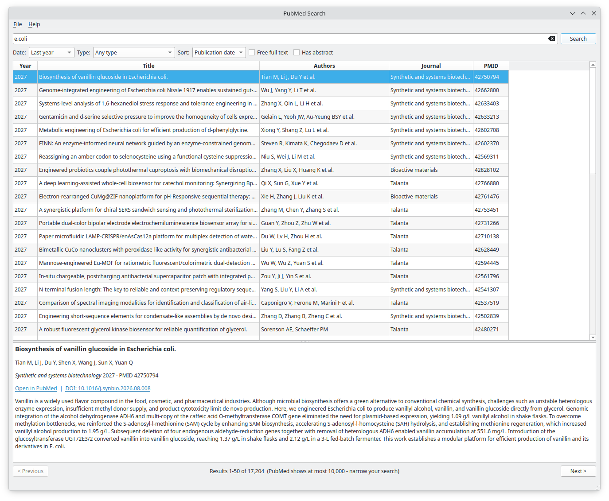

# PubMed Search

A simple desktop app for searching PubMed, built with C++ and Qt 6.

## Features
- PubMed query syntax, including field tags such as `[au]`, `[ti]` and `[tiab]`
- Filters for date, article type, free full text and abstract availability
- Sorting, paging, and an abstract viewer
- Export results to CSV or a PMID list

## Build (Linux)
    sudo apt install build-essential cmake qt6-base-dev
    cmake -B build && cmake --build build
    ./build/PubMedSearch

## Notes
Records come from PubMed via the NCBI E-utilities. An NCBI API key is
optional (Settings menu) and raises the request limit from 3 to 10 per second.

This project is not affiliated with or endorsed by NCBI or the U.S. National
Library of Medicine. See the
[NCBI Disclaimer and Copyright notice](https://www.ncbi.nlm.nih.gov/About/disclaimer.html).
